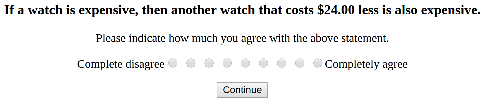

# Sorites

```{r echo=F, quiet=T}
char = function(v) { return(as.character(v)) }
num = function(v) { return(as.numeric(as.character(v))) }
library(rjson)
library(plyr)
library(ggplot2)
source("~/opt/r_helper_scripts/bootsSummary.R")
new_theme = theme_bw(10) +
  theme(panel.grid=element_blank())
theme_set(new_theme)
```

## High-level summary

We ran Experiment 1 to get people's endorsements of the sorites premise with various parameters, then a prior elicitation (Experiment 2), then re-ran the sorites experiment with values that were based on cumulants of the elicited prior experiment in Experiment 3.

The data from Experiment 3 for the inductive premise seemed kind of noisy, so I simplified the language (relative clause phrasing instead of conditional phrasing) and ran Experiment 4. I think the meanings are the same, since we have pretty high correlations between versions of the experiment with these two different phrasings.

The model fits the data from Experiment 4 very well, except for the concrete sorites premise on watches. People endorse "A watch that costs \$X is expensive" more than the model predicts. People's aggregated responses also seem to have a narrower range than the model's probabilities.

## Model

### Adjective Model

Literal Listener's probability distribution over the values $X$ are is prior, conditioned on the utterance being true and renormalized.

$$P_{L0}(x | u, \theta) \propto \delta_{u \mbox{ is true}} \cdot P(x)$$

Speaker's utility is the negative cost and the log probability of the actual state of the world under the Literal Listener's posterior. This means that the more surprised the Literal Listener would be to hear the true state of the world after already hearing the utterance, the less good the utterance would be.

$$\mathbb{U}_{S}(u | x, \theta) = log(P_{L0}(x|u, \theta)) - cost(u)$$

The speaker then chooses an utterance by soft-maximizing their utility funciton.

$$P_{S}(u|x, \theta) \propto e^{\lambda \mathbb{U}_{S}(u|x, \theta)}$$

The pragmatic listener infers both the threshold $\theta$ and the value $x$ conditioning on the speaker choosing the given utterance.

$$P_{L1}(x, \theta | u) \propto P_{S}(u|x, \theta)P(x)P(\theta)$$

### Sorites premises

Inductive premise: "An *OBJECT* that costs \$E less than an expensive *OBJECT* is still expensive."

$$ P( X - \varepsilon > \theta | X, \theta ) $$

Where X is the inferred price of an "expensive" *OBJECT*.

Concrete premise: "An *OBJECT* that costs \$X is expensive."

$$ P( X > \theta | X, \theta ) $$

### Alternative utterances

It's not clear what the alternative utterances in the adjective model should be. I use "adjective" and "say nothing" for computational ease when fitting parameters in the simulations.

TO BE CONTINUED...

I could next run the model, with these best parameter settings, for a few different sets of alternative utterances:

*  "adjective", "say nothing", "opposite of adjective" (with its own threshold, same cost)
*  "adjective", "say nothing", "opposite of adjective", "not adjective" (same threshold as "adjective"), "not opposite of adjective" (same threshold as "opposite of adjective")
* "adjective", "say nothing", "intensifier adjective" (with its own threshold, double the cost)
* "adjective", "say nothing", "intensifier adjective", "opposite of adjective", "intensifier opposite of adjective"

According to our discussion in lab meeting about alternatives probably being less complex than the actual utterance, the minimal alternative set ("adjective" and "say nothing") and the alternative set containging the opposite of the adjective ("adjective", "say nothing", and "opposite of adjective") are probably the most plausible.


### Model parameters

The free parameters in our model are the rationality parameter $\lambda$ and the cost of the adjective utterance $C$. In our simulations, we allow both parameters to vary from 1 to 10 and fit to the combination of parameter settings that yields the smallest distance between model predictions and human responses for the sorites inductive premises.

## Experiment 1: Endorsement of sorites premises

We ran two different versions of the [first sorites experiment](http://web.stanford.edu/~erindb/sorites/sorites.html), with two different phrasings. In both versions, participants saw two
different kinds of questions regarding 5 different categories of objects. These questions were all randomly intermixed. One of
the kinds of questions represented the concrete premise and one represented the inductive premise. Participants were asked
to rate each of these questions on a 9-point Likert scale from “Completely disagree” (-4) to “Completely agree” (4).

There were two different phrasings for this experiment, which produced similar ratings from participants. (More discussion in the 2015 March 26 update.)



We varied the amount $\varepsilon$ less expensive that the item in the inductive premise was, the price $X$ given in the concrete premise,
and the type of item. As predicted, participants gave
graded judgements that varied by the amounts $\varepsilon$ and $X$ and by the items (different items have different distributions
over prices). The exact values of the $\varepsilon$s and $X$s were chosen based on scraped prices from ebay and amazon.

More analysis of this data is detailed in `sorites_2015march26.pdf`.

## Experiment 2: Priors on prices (binned histogram)

We showed 30 participants [this experiment](http://web.stanford.edu/~erindb/sorites-analysis/experiments/exp1-prior/morebins.html).

For each of 5 items (*coffee maker*, *laptop*, *headphones*, *watch*, and *sweater*), participants saw a page full of vertical sliders (between 50 and 80 sliders in total, depending on the item) in rows of 10 sliders each. Participants were asked to indicate, using the sliders, how likely they thought it was that the price of the item was within various ranges. The ranges (e.g. \$0-\$50, \$50-\$100) were arranged in order from the lowest range (starting at \$0) to the highest (greater than some maximum dollar amount, which depended on the item). Participants' responses were coded from 0 ("Extremely Unlikely") to 1 ("Extremely Likely").

We chose the price ranges for each item based on pilot experiments. We wanted sufficient detail about the tails of the distributions, so we chose maximum values for each item such that the average endorsement of the highest bin was very low (in our experiment, the average endorsement for the highest bin was always less than 0.15). We also wanted sufficient granularity to address the sorites inductive premise, even for very small $\varepsilon$. We threfore chose the width of the bins so that, for every price $X$ and for every $\varepsilon$ in our original sorites premises experiment, we could confidently estimate the probability of an item $\varepsilon$ less expensive than $X$. The resulting distributions are fairly smooth, allowing us to interpolate within the bins as needed. Our level of resolution also allowed us to capture detail in peaky parts of the distributions (usually the smaller ranges).

Participants' repsonses, normalized to represent probabilities, are shown in the graph below. We used these data as the prior distributions for our simulations.

```{r echo=F, quiet=T, fig.width=8.5, fig.height=3}
get_data = function(filename) {
  d = read.csv(filename, as.is=T)
  desired_columns = c("workerid", paste("Answer",
                                        c(0:4, "cond", "language", "comments", "age"),
                                        sep="."))
  d = d[,desired_columns]
  d = reshape(d,
                                  varying = paste("Answer", 0:4, sep="."),
                                  v.names = "trial_data",
                                  timevar = "trial", direction = "long")
  current_column_names = paste("Answer", c("cond", "language", "comments", "age"),
                               sep=".")
  desired_column_names = c("buyer_gender", "language", "comments", "age")
  mapply(function(current_name, desired_name) {
    names(d)[
      names(d) == current_name
      ] <<- desired_name
    }, current_column_names, desired_column_names)
  d$comments = sapply(d$comments,
                                          function(comment) {
                                            comment_1 = gsub("\"", "", comment)
                                            comment_2 = gsub("[+]", " ", comment_1)
                                            return(comment_2)
                                            })
  d = ddply(d, .(workerid, trial), .fun=function(df) {
    trial_data = fromJSON(df$trial_data)
    new_df = data.frame(
      lowers = trial_data$lowers, #vector
      uppers = char(unlist(trial_data$uppers)), #vector
      responses = trial_data$responses, #vector
      normed_responses = trial_data$responses / sum(trial_data$responses)
      )
    new_df$buyer = trial_data$buyer
    new_df$item = trial_data$item
    new_df$max = trial_data$max
    new_df$workerid = df$workerid
    new_df$buyer_gender = df$buyer_gender
    new_df$language = df$language
    new_df$comments = df$comments
    new_df$age = df$age
    new_df$trial = df$trial
    return(new_df)
    }, .drop=F)
  return(d)
}
prior_experiment_data = get_data("data/sorites-prior.csv")

aggregate_prior_distributions = bootsSummary(prior_experiment_data,
                                             measurevar="normed_responses",
                                             groupvars=c("item", "lowers"))

prior_distributions_plot = ggplot(aggregate_prior_distributions,
                                  aes(x=lowers, y=normed_responses, colour=item, fill=item)) +
  geom_line() +
  geom_ribbon(aes(ymin=bootsci_low, ymax=bootsci_high), alpha=0.2, lwd=0) +
  facet_grid(. ~ item, scale="free_x")
print(prior_distributions_plot)

write.csv(aggregate_prior_distributions[,c("item", "lowers", "normed_responses")],
          "data/mean_priors.csv", row.names=F)
write.csv(prior_experiment_data[,c("item", "lowers", "normed_responses", "workerid")],
          "data/all_priors.csv", row.names=F)
```

### Some potential problems with this experiment design

For each item, we always showed the same bins, and the same linebreaks between rows of bins. So for every participant, some pairs of adjacent bins were always farther away from each other than every other pair of adjacent bins were. This doesn't seem obvious from the responses that people gave, but it could have caused variance in responses or confusion for participants. We could have avoided this by making the sliders horizontal rather than vertical.

## Experiment 3: Endorsement of wider range of sorites premises

[link to Experiment 3](http://web.stanford.edu/~erindb/sorites-analysis/experiments/exp3-cocomd/exp3-sorites.html)

In our original sorites experiment, participants on average never rejected any of the premises very strongly. We wanted to see if giving participants a wider range of values for the premises would change that.

We wanted a wide range of prices for the concrete sorites premise, so that some would be obviously expensive and others would be obviously not expensive. For each item, and for each cumulative probability 0.1, 0,3, 0.5, 0.7, and 0.9, we approximated a price with that cumulative probability by chosing the highest price below that cumulative probability (e.g. since the sum of the average normed slider values for all bins up to "\$18-\$21" for *sweater* was the first such sum that was greater than or equal to 0.1, we chose the price \$18 as the smallest price for the concrete premise for sweaters). The prices were usually a little bit lower than the actual prices with those cumulative probabilities, but within a bin-width of the actual price with that cumulative probability.

We also wanted a wide ranges of prices for the inductive premise. For these, we chose proportions (0.01, 0.1, 0.5, 0.7, and 1) of the approximate 90% confidence intervals (calculated by subtracting the 0.05 comulative probability as above from the 0.95 cumulative probability).

```{r, echo=F}
# ## check that total probability for each item is 1
# ddply(aggregate_prior_distributions, .(item), summarise, total_prob=sum(normed_responses))

## calculate discrete cdf
aggregate_prior_distributions = ddply(aggregate_prior_distributions, .(item), function(df) {
  df$cumulative = sapply(1:nrow(df), function(i) {
    return(sum(df$normed_responses[1:i]))
  })
  return(df)
})

epsilons_and_vals = ddply(aggregate_prior_distributions, .(item), function(df) {
  ## because fixing this number just adds a constant to both values, it doesn't make a difference.
  cum0.95_other = (df$lowers[df$cumulative >= 0.95][[1]] + df$lowers[df$cumulative <= 0.95][[length(df$lowers[df$cumulative <= 0.95])]]) / 2
  cum0.05_other = (df$lowers[df$cumulative >= 0.05][[1]] + df$lowers[df$cumulative <= 0.05][[length(df$lowers[df$cumulative <= 0.05])]]) / 2
  cum0.95 = df$lowers[df$cumulative >= 0.95][[1]]
  cum0.05 = df$lowers[df$cumulative >= 0.05][[1]]
  conf0.9 = cum0.95_other - cum0.05_other
  new_df = data.frame(
    item = df$item[[1]],
    `X0.1` = df$lowers[df$cumulative >= 0.1][[1]],
    `X0.3` = df$lowers[df$cumulative >= 0.3][[1]],
    `X0.5` = df$lowers[df$cumulative >= 0.5][[1]],
    `X0.7` = df$lowers[df$cumulative >= 0.7][[1]],
    `X0.9` = df$lowers[df$cumulative >= 0.9][[1]],
    `E0.01` = 0.01 * conf0.9,
    `E0.1` = 0.1 * conf0.9,
    `E0.5` = 0.5 * conf0.9,
    `E0.7` = 0.7 * conf0.9,
    `E1` = 1 * conf0.9
  )
  return(new_df)
})

print(epsilons_and_vals)
```

Experiment 3 was otherwise identical to the version of Experiment 1 with conditional statements.

Looking at the individual responses (the lighter lines in the plot), it seems like there was more variation in participants' responses to the inductive premise questions, perhaps because participants did not understand the prompt as well.

```{r, echo=F, fig.width=8.5, fig.height=3}
get_sorites_data = function(filename) {
  d = read.csv(filename, as.is=T)
  d = ddply(d, .(workerid), function(df) {
    response_data = fromJSON(df$Answer.responses)
    subj_data = fromJSON(df$Answer.subj_data)
    new_df = data.frame(
      response=sapply(response_data, function(d) {
        return(num(d$response) - 4) }),
      dollar_amount=sapply(response_data, function(d) {
        return(d$dollar_amount) }),
      level=sapply(response_data, function(d) {
        return(d$level) }),
      qtype=factor(sapply(response_data, function(d) {
        return(d$qtype) })),
      item=factor(sapply(response_data, function(d) {
        return(d$object) })),
      phrasing=factor(sapply(response_data, function(d) {
        return(d$phrasing) })),
      workerid=df$workerid,
      language=subj_data$language,
      age=subj_data$age,
      education=subj_data$education,
      comments=subj_data$comments )
    return(new_df)})
  d$workerid = factor(d$workerid)
  d$age = num(d$age)
  d$education = ordered(d$education)
  return(d)
}
sorites_data = get_sorites_data("data/exp3.csv")

aggregate_sorites_data = bootsSummary(sorites_data,
                                      measurevar="response",
                                      groupvars=c("item", "qtype",
                                                  "dollar_amount"))

aggregate_sorites_plot = ggplot(aggregate_sorites_data, aes(x=dollar_amount, y=response,
                                   colour=item)) +
  geom_point(size=2) +
  geom_line() +
  geom_line(data=sorites_data, aes(x=dollar_amount, y=response,
                              colour=item, group=workerid), alpha=1/15) +
  ylim(-4, 4) +
  facet_grid(qtype ~ item, scale="free_x")
print(aggregate_sorites_plot)

write.csv(sorites_data, "data/sorites_data.csv", row.names=F)
write.csv(aggregate_sorites_data, "data/aggregate_sorites_data.csv", row.names=F)
```

## Experiment 4: Relative clause version of Experiment 3

[link to Experiment 4](http://web.stanford.edu/~erindb/sorites-analysis/experiments/exp4-relative-clause/exp4-sorites.html)

On the off-chance that people were confused by the wording in Experiment 3, and that they would not be confused by the wording as much if I used relative clauses, I ran Experiment 4. Instead of using the conditional wording for the inductive premsise (e.g. "If a sweater is expensive, then another sweater that costs \$171.00 less is also expensive."), I used the relative clause wording (e.g. "A sweater that costs \$171.00 less than an expensive sweater is also expensive."). 

```{r, echo=F, fig.width=8.5, fig.height=3}
sorites_relative_data = get_sorites_data("data/sorites-relative.csv")

aggregate_sorites_relative_data = bootsSummary(sorites_relative_data,
                                      measurevar="response",
                                      groupvars=c("item", "qtype",
                                                  "dollar_amount"))

aggregate_sorites_relative_plot = ggplot(aggregate_sorites_relative_data, aes(x=dollar_amount, y=response,
                                   colour=item)) +
  geom_point(size=2) +
  geom_line() +
  geom_line(data=sorites_relative_data, aes(x=dollar_amount, y=response,
                              colour=item, group=workerid), alpha=1/15) +
  ylim(-4, 4) +
  facet_grid(qtype ~ item, scale="free_x")
print(aggregate_sorites_relative_plot)

split_half = function(d, n_samples) {
  workers = unique(d$workerid)
  n_subj = length(workers)
  resampled_correlations = sapply(1:n_samples, function(i) {
    resampled_workers = sample(workers, n_subj)
    half1_workers = resampled_workers[1:round(n_subj/2)]
    half2_workers = resampled_workers[round(n_subj/2)+1:n_subj]
    half1_data = subset(d, workerid %in% half1_workers)
    half2_data = subset(d, workerid %in% half2_workers)
    return(cor(ddply(half1_data, .(item, qtype, dollar_amount), summarise,
                     mean_response=mean(response))$mean_response,
               ddply(half2_data, .(item, qtype, dollar_amount), summarise,
                     mean_response=mean(response))$mean_response)) })
  return( c( mean = mean(resampled_correlations),
             bootsci_high = quantile(resampled_correlations, 0.975),
             bootsci_low = quantile(resampled_correlations, 0.025) ) )
  }
# split_half(sorites_relative_data, 100)
# split_half(sorites_data, 100)

sorites_relative_data_split_half = split_half(subset(sorites_relative_data, qtype == "inductive"), 100)
sorites_dat_split_half = split_half(subset(sorites_data, qtype=="inductive"), 100)

sorites_relative_data_split_half_concrete = split_half(subset(sorites_relative_data, qtype == "concrete"), 100)
sorites_dat_split_half_concrete = split_half(subset(sorites_data, qtype=="concrete"), 100)

write.csv(sorites_relative_data, "data/sorites_relative_data.csv", row.names=F)
write.csv(aggregate_sorites_relative_data, "data/aggregate_sorites_relative_data.csv", row.names=F)
```

The split-half correlation on the inductive premises for the relative clause version (`r sorites_relative_data_split_half[["mean"]]`) was higher than for the conditional version (`r sorites_dat_split_half[["mean"]]`) but not as high as the split-half correlation for the concrete premise in both experiments (`r sorites_relative_data_split_half_concrete[["mean"]]` and `r sorites_dat_split_half_concrete[["mean"]]`).

The overall correlation between responses to Experiment 3 and responses to Experiment 4 was `r cor(aggregate_sorites_data$response, aggregate_sorites_relative_data$response)`.

## Simulations

### Model results fit to Experiment 3 (conditional)

```{r, echo=F}
model_sorites = function(d) {
  files <- dir("simulations/model_output/", pattern="*.csv")
  
  d = do.call(rbind, lapply(files, function(file) {
    return(read.csv(paste("simulations/model_output/", file, sep=""),
                    colClasses=c("character",
                                 "numeric", "numeric", "numeric",
                                 "numeric", "numeric", "numeric"),
                    col.names=c("item", "cost", "lambda", "value", "theta", "score", "probability")))
  }))
  
  model = ddply(d, .(item, cost, lambda), function(df) {
    obj = df$item[[1]]
    epsilons = unlist(epsilons_and_vals[epsilons_and_vals$item == obj, c("E0.01", "E0.1", "E0.5", "E0.7", "E1")])
    values = unlist(epsilons_and_vals[epsilons_and_vals$item == obj, c("X0.1", "X0.3", "X0.5", "X0.7", "X0.9")])
    new_df = data.frame(
      item = obj,
      cost = df$cost[[1]],
      lambda = df$lambda[[1]],
      qtype = c( rep("concrete", length(epsilons)),
                 rep("inductive", length(values)) ),
      dollar_amount = c( values, epsilons ),
      response = c( sapply(values,
                           function(dollar_amount) {
                             ## concrete
                             return(sum(df$probability[dollar_amount > df$theta ])) }),
                    sapply(epsilons,
                           function(dollar_amount) {
                             ## indutive
                             return(sum(df$probability[df$value - dollar_amount > df$theta]))  }) )
    )
  })
  return(model)
}

model = model_sorites()

get_fits = function(experiment_data) {
  return(ddply(model, .(cost, lambda), function(df) {
      return(cor(df$response, experiment_data$response))
  }))
}

sorites_fits = get_fits(aggregate_sorites_data)
sorites_best_parameters = sorites_fits[sorites_fits$V1 == max(sorites_fits$V1),]
sorites_best_cost = sorites_best_parameters$cost
sorites_best_lambda = sorites_best_parameters$lambda

sorites_expt = aggregate_sorites_data[, c("item", "qtype", "dollar_amount", "response")]
sorites_expt$model_or_expt = "expt"
sorites_best_model = model[model$lambda == sorites_best_lambda & model$cost == sorites_best_cost, c("item", "qtype", "dollar_amount", "response")]
sorites_best_model$model_or_expt = "model"
sorites_model_and_expt = rbind(sorites_best_model, sorites_expt)
```

For Experiment 3, where the prhasing was a conditional statement, the best-fit parameters were $C=`r sorites_best_cost`$ and $\lambda=`r sorites_best_lambda`$ (I fit by choosing the parameters with the best correlation with the data). The lowest correlation between model and experimental data was `r min(sorites_fits$V1)` and the highest correlation was `r max(sorites_fits$V1)`. The correlation for only the inductive premises with the parameters fit for all the experimental data was `r cor(subset(sorites_best_model, qtype == "inductive")$response, subset(sorites_expt, qtype == "inductive")$response)`.

The model probabilities with the highest-correlation parameters and the (rescaled to [0, 1]) responses from Experiment 3 (conditional statements) are shown below. (CONFIDENCE INTERVALS FOR MODEL NEEDED)

```{r echo=F, fig.width=8.5, fig.height=4}
sorites_model_and_expt_same_scale = sorites_model_and_expt
sorites_model_and_expt_same_scale$response[sorites_model_and_expt_same_scale$model_or_expt == "expt"] = (sorites_model_and_expt_same_scale$response[sorites_model_and_expt_same_scale$model_or_expt == "expt"] + 4 )/8
sorites_model_and_expt_plot = ggplot(sorites_model_and_expt_same_scale, aes(x=dollar_amount, y=response, colour=item, linetype=model_or_expt)) +
  geom_point(size=2) +
  geom_line() +
  ylim(0, 1) +
  facet_grid(qtype ~ item, scale="free_x")
print(sorites_model_and_expt_plot)
```

A scatterplot of the same data is shown below. (CONFIDENCE INTERVALS FOR MODEL NEEDED)

```{r echo=F, fig.width=6, fig.height=4}
sorites_model_vs_expt = reshape(sorites_model_and_expt, direction="wide", v.names="response", timevar="model_or_expt", idvar=c("item", "qtype", "dollar_amount"))
sorites_model_vs_expt$bootsci_low = aggregate_sorites_data$bootsci_low
sorites_model_vs_expt$bootsci_high = aggregate_sorites_data$bootsci_high
sorites_model_vs_expt_plot = ggplot(sorites_model_vs_expt, aes(x=response.model, y=response.expt, colour=item)) +
  geom_point(size=3) +
  geom_errorbar(aes(x=response.model, ymin=bootsci_low, ymax=bootsci_high)) +
  facet_wrap(~ qtype)
print(sorites_model_vs_expt_plot)
```

###  Model results fit to Experiment 4 (relative clause)

```{r echo=F}
sorites_relative_fits = get_fits(aggregate_sorites_relative_data)
sorites_relative_best_parameters = sorites_relative_fits[sorites_relative_fits$V1 == max(sorites_relative_fits$V1),]
sorites_relative_best_cost = sorites_relative_best_parameters$cost
sorites_relative_best_lambda = sorites_relative_best_parameters$lambda

sorites_relative_expt = aggregate_sorites_relative_data[, c("item", "qtype", "dollar_amount", "response")]
sorites_relative_expt$model_or_expt = "expt"
sorites_relative_best_model = model[model$lambda == sorites_relative_best_lambda &
                                      model$cost == sorites_relative_best_cost,
                                    c("item", "qtype", "dollar_amount", "response")]
sorites_relative_best_model$model_or_expt = "model"
sorites_relative_model_and_expt = rbind(sorites_relative_best_model, sorites_relative_expt)
```

For Experiment 4, where the prhasing was a relative clause, the best-fit parameters were $C=`r sorites_relative_best_cost`$ and $\lambda=`r sorites_relative_best_lambda`$ (I fit by choosing the parameters with the best correlation with the data). The lowest correlation between model and experimental data was `r min(sorites_relative_fits$V1)` and the highest correlation was `r max(sorites_relative_fits$V1)`. The correlation for only the inductive premises with the parameters fit for all the experimental data was `r cor(subset(sorites_relative_best_model, qtype == "inductive")$response, subset(sorites_relative_expt, qtype == "inductive")$response)`.

The model probabilities with the highest-correlation parameters and the (rescaled to [0, 1]) responses from Experiment 4 are shown below. (CONFIDENCE INTERVALS FOR MODEL NEEDED)

```{r echo=F, fig.width=8.5, fig.height=4}
sorites_relative_model_and_expt_same_scale = sorites_relative_model_and_expt
sorites_relative_model_and_expt_same_scale$response[sorites_relative_model_and_expt_same_scale$model_or_expt == "expt"] = (sorites_relative_model_and_expt_same_scale$response[sorites_relative_model_and_expt_same_scale$model_or_expt == "expt"] + 4 )/8
sorites_relative_model_and_expt_plot = ggplot(sorites_relative_model_and_expt_same_scale, aes(x=dollar_amount, y=response, colour=item, linetype=model_or_expt)) +
  geom_point(size=2) +
  geom_line() +
  ylim(0, 1) +
  facet_grid(qtype ~ item, scale="free_x")
print(sorites_relative_model_and_expt_plot)
```

A scatterplot of the same data is shown below. (CONFIDENCE INTERVALS FOR MODEL NEEDED)

```{r echo=F, fig.width=6, fig.height=4}
sorites_relative_model_vs_expt = reshape(sorites_relative_model_and_expt, direction="wide", v.names="response", timevar="model_or_expt", idvar=c("item", "qtype", "dollar_amount"))

sorites_relative_model_vs_expt$bootsci_low = aggregate_sorites_relative_data$bootsci_low
sorites_relative_model_vs_expt$bootsci_high = aggregate_sorites_relative_data$bootsci_high

sorites_relative_model_vs_expt_plot = ggplot(sorites_relative_model_vs_expt, aes(x=response.model, y=response.expt, colour=item)) +
  geom_point(size=3) +
  geom_errorbar(aes(x=response.model, ymin=bootsci_low, ymax=bootsci_high)) +
  facet_wrap(~ qtype)
print(sorites_relative_model_vs_expt_plot)
```

## Issues to resolve

The concrete premise for watches is weird.

The model has a wider range of responses than people do.

## More detail

### Priors by worker

Here are our responses on the prior experiment by worker. At a glance, it looks like there are some individual differences on how people are using the scales but no one is giving answers that don't apear to be sensitive to the item and price (it looks like most poeple are not clicking randomly).

```{r, echo=F, fig.width=8.5, fig.height=11}
by_worker_priors = ggplot(prior_experiment_data,
                          aes(x=lowers, y=responses, colour=item)) +
  geom_line() +
  facet_grid(workerid ~ item, scale="free_x")
print(by_worker_priors)
```

Participants 6 and 11 gave really jittery responses for some reason. Not sure why.

### Prior resolution and range

For all of the highest bins in the prior elicitation experiment, the average endorsement for that bin was less than 0.15.

```{r, echo=F}
aggregate_prior_experiment_data = bootsSummary(prior_experiment_data,
                                               measurevar="responses",
                                               groupvars=c("item", "lowers"))

# prior_experiment_plot = ggplot(aggregate_prior_experiment_data, aes(x=lowers, y=responses, colour=item, fill=item)) +
#   geom_line() +
#   geom_ribbon(aes(ymin=bootsci_low, ymax=bootsci_high), alpha=0.2, lwd=0) +
#   facet_grid(. ~ item, scale="free_x")
# print(prior_experiment_plot)

## check that all of the highest bins are low
highest_bin_data = ddply(aggregate_prior_experiment_data, .(item), summarize,
                         max_bin_price = max(lowers),
                         max_bin_response = responses[lowers == max(lowers)])
print(highest_bin_data)
```

for each item, the smallest epsilons in Experiment 3 were always less than half and greater than a third of the bin width.

```{r echo=F}
bin_width_data = ddply(aggregate_prior_distributions, .(item), summarize,
                       bin_width = lowers[2])
bin_width_data$exp1_smallest_epsilon = c()
bin_width_data$exp2_smallest_epsilon = c(
    "coffee maker" = 2.00,
    "headphones" = 2.58,
    "laptop" = 18.50,
    "sweater" = 1.71,
    "watch" = 24.00
  )
```

### Sorites (Experiments 3 and 4) by worker

Here are the responses to the second sorites experiment by worker. It looks like maybe not all participants understood the task. For example, participants 0 and 26 gave the same responses for both the inductive and concrete premises.

```{r, echo=F, fig.width=8.5, fig.height=11}
sorites_by_worker_plot = ggplot(sorites_data, aes(x=dollar_amount,
                                                  y=response,
                                                  colour=item,
                                                  linetype=qtype)) +
  geom_point(size=2) +
  geom_line() +
  ylim(-4,4) +
  facet_grid(workerid ~ item, scale="free_x")
print(sorites_by_worker_plot)
```

When I used the relative clause ratings, it looks like people might be less confused.

```{r, echo=F, fig.width=8.5, fig.height=11}
sorites_relative_by_worker_plot = ggplot(sorites_relative_data, aes(x=dollar_amount,
                                                  y=response,
                                                  colour=item,
                                                  linetype=qtype)) +
  geom_point(size=2) +
  geom_line() +
  ylim(-4,4) +
  facet_grid(workerid ~ item, scale="free_x")
print(sorites_relative_by_worker_plot)
```

### Model code in WebPPL

```
// webppl sorites.wppl --require-js ./simpleCSV.js

var alternatives = "adjnull";

var items = ["coffee maker", "headphones", "laptop", "sweater", "watch"];

var get_parameters = function(item) {
  var prior_csv_data = simpleCSV.readCSV("mean_priors.csv").data;
	var item_data = filter(
		function(trio) {
			return item == trio[0];
		}, prior_csv_data.slice(1, prior_csv_data.length - 1)
	);
	var values = map(function(trio) {return trio[1];}, item_data);
	var probabilities = map(function(trio) {return trio[2];}, item_data);
	return {
		"values": map( function(prob) {return global.parseFloat(prob);} , values),
		"probabilities": map( function(prob) {return global.parseFloat(prob);} , probabilities)
	};	
}

var get_prior = cache(function(item) {
	var parameters = get_parameters(item);
	var values = parameters.values;
	var probabilities = parameters.probabilities;
	return function() {
		return values[discrete(probabilities)];
	}
})

var get_theta_prior = cache(function(item) {
	var values = get_parameters(item).values;
	return function() {
		return uniformDraw(values);
	};
})

var is_true = cache(function(utterance, value, theta) {
	if (utterance == "adj") {
		return value >= theta;
	} else if (utterance == "null") {
		return true;
	} else {
		console.log("err 55");
	}
})

var literal_listener = cache(function(utterance, theta, item) {
	return Enumerate(
		function() {
			var prior = get_prior(item);
			var value = prior();
			factor(is_true(utterance, value, theta) ? 0 : -Infinity)
			return value;
		}
	)
})

var utterance_prior = cache(function(cost) {
	return Enumerate(function() {
		var utterances = ["adj", "null"];
		var costs = [cost, 0];
		var probabilities = map(function(c) {return Math.exp(- c);}, costs);
		return utterances[discrete(probabilities)];
	});
})

var speaker = cache(function(value, theta, item, cost, lambda) {
	return Enumerate(
		function() {
			var utterance = sample(utterance_prior(cost));
			var literal_interpretation = literal_listener(utterance, theta, item);
			var score = literal_interpretation.score([], value);
			factor(score * lambda);
			return utterance;
		}
	)
})

var listener = function(utterance, item, cost, lambda) {
	return Enumerate(
		function() {
			var prior = get_prior(item);
			var theta_prior = get_theta_prior(item);
			var value = prior();
			var theta = theta_prior();
			var score = speaker(value, theta, item, cost, lambda).score([], utterance);
			factor(score);
			return [value, theta];
		}
	)
}

var costs = [1, 2, 3, 4, 5, 6];
var lambdas = [1, 2, 3, 4, 5, 6];

map(function(cost) {
	map(function(lambda) {
		map(function(item) {
			console.log("running " + item + ": " + alternatives + "_cost" + cost + "_lambda" + lambda);
			var listenerERP = listener("adj", item, cost, lambda);
			console.log("finished running " + item + ": " + alternatives + "_cost" + cost + "_lambda" + lambda);
			var model_output = {
				"data" : map(function(pair) {
					var value = pair[0];
					var theta = pair[1];
					var score = listenerERP.score([], pair);
					var probability = Math.exp(score);
					return [item, cost, lambda, value, theta, score, probability];
				}, listenerERP.support())
			}
			simpleCSV.writeCSV(model_output, "model_output/" + item + "_" + alternatives + "_cost" + cost + "_lambda" + lambda + ".csv");
			return 1;
		}, items);
		return 1;
	}, lambdas);
	return 1;
}, costs)
```

### Varying alternative utterances

TO BE CONTINUED....

COMPARE MODEL TO EXPERIMENT 4 WITH DIFFERENT ALTERNATIVE UTTERANCES AND LAMBDA 6 AND COST 1.