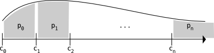

```{r load libraries, echo=F, message=F, warning=F}
library(rjson)
library(fitdistrplus)
library(ggplot2)
library(dplyr)
library(tidyr)
library(grid)
library(ggthemes)
library(languageR)
library(psych)
library(lme4)
library(lmerTest)
library(diagram)
library(boot)
char = as.character
num = function(x) {return(as.numeric(char(x)))}
grab = function(colname) { return(function(lst) { return(unlist(lst[[colname]])) }) }
options(digits=3)
mean.sd = funs(mean, sd)
```

## Description of experiment

A copy of the experiment can be found at: [`experiments/experiment2/insurance-inventory.html`](../experiments/experiment2/insurance-inventory.html).

This was the first prior elicitation experiment that I worked on, which we ran in October of 2013. For 10 categories of items ("watch", "coffee maker", "laptop", "electric kettle", "headphones", "sweater", "camera", "backpack", "wallet", and "bike"), we asked participants to fill in guesses about the prices of those items. We gave them one piece of information for each item: whether it cost more or less than a particular cutoff (50, 100, 500, 1000, 2000, 5000, or 10000). The cutoffs were varied between participants. Each participant saw every item twice, once above the cutoff and once below.

There are two different data files for this experiment, because when I put the experiment up on mTurk the first time, I gave it the tagline "Insurance Inventory", which sounds really boring. People signed up, but really slowly. So after a day passed and I had only gotten 18 participants, I re-posted with a new tagline: "Store Rescue". 3 participants were repeats. Once we excluded repeats, there were 105 participants in the experiment.

```{r load data, echo=F, warning=F, message=F}
# ## this is the code to generate the "repeat-workers" file from the raw results
# ## i'm not going to push this file, so i've cached the object "repeat.workers" in
# ## the data directory
# rawA = read.csv('../data/raw-data/experiment2-fileA.results', sep='\t') %>%
#   select(hitid, workerid)
# rawB = read.csv('../data/raw-data/experiment2-fileB.results', sep='\t') %>%
#   select(hitid, workerid)
# raw = rbind(rawA, rawB)
# repeat.workers = raw %>% group_by(workerid) %>% summarise(N = length(hitid)) %>% as.data.frame %>%
#   filter(N==2) %>%
#   mutate(index.in.A = sapply(char(.$workerid), function(w) {return(which(rawA$workerid == w))}),
#          index.in.B = sapply(char(.$workerid), function(w) {return(which(rawB$workerid == w))})) %>%
#   select(index.in.A, index.in.B)
# write.csv(repeat.workers, '../data/experiment2-repeat-workers.csv', row.names=F)
repeat.workers = read.csv('../data/experiment2-repeat-workers.csv')

## combine two data files together:
d0 = rbind(read.csv('../data/experiment2-fileA.csv'),
           read.csv('../data/experiment2-fileB.csv') %>%
             filter(!(workerid %in% repeat.workers$index.in.B)) %>%
             mutate(workerid = 1:length(workerid) + 17))
d0 = d0 %>%select(workerid, 31:54) %>%
  rename(language=Answer.language,
         age=Answer.age,
         comments=Answer.comments) %>%
  mutate(language = factor(sub('"', '', sub('"', '', char(language)))))
```

## Results

Lots of participants in high cutoff conditions commented that it was almost completely impossible for a store to have items of those categories above the cutoffs.

```{r format data, echo=F, message=F, warning=F, fig.width=8, fig.height=3}
# ### at this point, could exclude particpants whose native language was not english:
# d0 = d0 %>% filter(language %in% c("english", "English", "English+", "Englsih"))
# print(unique(d0$comments))
dlong = d0 %>% select(-language, -comments, -age) %>%
  gather('qn', 'price', c(2:5, 7:22)) %>%
  mutate(qn = sapply(.$qn, function(q) {return(substring(q, 8))}),
         qn = gsub('coffee\\.maker', 'coffee maker', qn),
         qn = gsub('electric\\.kettle', 'electric kettle', qn)) %>%
  separate(qn, c('item', 'direction'), sep='\\.') %>%
  rename(cutoff = Answer.cutoff) %>%
  mutate(item = factor(item),
         direction = factor(direction),
         workerid = factor(workerid))
```

Here are the results for item="sweater" and cutoff="1000".

```{r plotsweater1000data, echo=F, message=F, warning=F, fig.width=8, fig.height=3}
dlong %>%
  mutate(bin = paste(direction, cutoff)) %>%
  filter(item=='sweater' & cutoff=='1000') %>%
  ggplot(., aes(x=price, colour=bin, fill=bin)) +
  geom_density() +
  facet_wrap(~ bin, scale='free') +
  theme_few() + scale_colour_few() + scale_fill_few()
```

### Prices below a particular range

When the cutoff was (e.g.) 50, of course all of the prices participants gave were at or below 50. When the cutoff was higher, the proportion at or below 50 decreased.

```{r plotproportionbelowdata, echo=F, message=F, warning=F, fig.width=8, fig.height=3}
proportion.below = dlong %>%
  filter(direction == 'below') %>%
  group_by(cutoff, item) %>%
  summarise(proportionbelow.50 = sum(price <= 50)/length(price),
            proportionbelow.100 = sum(price <= 100)/length(price),
            proportionbelow.500 = sum(price <= 500)/length(price),
            proportionbelow.1000 = sum(price <= 1000)/length(price),
            proportionbelow.2000 = sum(price <= 2000)/length(price),
            proportionbelow.5000 = sum(price <= 5000)/length(price),
            proportionbelow.10000 = sum(price <= 10000)/length(price)) %>%
  as.data.frame %>%
  gather('proportion.below', 'proportion', 3:9) %>%
  separate(proportion.below, c('nothing', 'proportion.below'), sep='\\.') %>%
  select(-nothing) %>%
  mutate(proportion.below = num(proportion.below)) %>%
  filter(proportion.below != 10000)
ggplot(proportion.below, aes(x=ordered(cutoff), y=proportion, colour=item, fill=item)) +
  geom_bar(stat='identity', position='dodge', alpha=1/3) +
  facet_grid(proportion.below~ item) +
  theme_few()
```

### Prices below a particular range

When the cutoff was (e.g.) 50, of course all of the prices participants gave were at or below 50. When the cutoff was higher, the proportion at or below 50 decreased.

```{r plotproportionabovedata, echo=F, message=F, warning=F, fig.width=8, fig.height=3}
proportion.above = dlong %>%
  filter(direction == 'above') %>%
  group_by(cutoff, item) %>%
  summarise(proportionabove.50 = sum(price > 50)/length(price),
            proportionabove.100 = sum(price > 100)/length(price),
            proportionabove.500 = sum(price > 500)/length(price),
            proportionabove.1000 = sum(price > 1000)/length(price),
            proportionabove.2000 = sum(price > 2000)/length(price),
            proportionabove.5000 = sum(price > 5000)/length(price),
            proportionabove.10000 = sum(price > 10000)/length(price)) %>%
  as.data.frame %>%
  gather('proportion.above', 'proportion', 3:9) %>%
  separate(proportion.above, c('nothing', 'proportion.above'), sep='\\.') %>%
  select(-nothing) %>%
  mutate(proportion.above = num(proportion.above)) %>%
  filter(proportion.above != 50)
ggplot(proportion.above, aes(x=ordered(cutoff), y=proportion, colour=item, fill=item)) +
  geom_bar(stat='identity', position='dodge', alpha=1/3) +
  facet_grid(proportion.above~ item) +
  theme_few()
```

We were planning to stitch these binned free-responses together, but we ended up abandoning this strategy because a) although these questions get us better *resolution* in the tails, we still don't necessarily have a good sense of the probability *mass* in the tails, and b) the fact that participants gave mostly round numbers (which mess with the density estimators) and thought the cutoffs completely improbable for some of the items and said they had to really re-imagine the category (so it's somewhat possible that we're not even sampling from the same distribution when the cutoff is very high) makes these data harder to analyze.

The basic idea for how to analyze these data was to estimate $p_k$, the amount of probability mass above cutoff $c_k$ and below cutoff $c_{k+1}$, by looking at the proportion of samples within that range when the cutoff was something higher or lower, e.g. $p_0 \approx (1-\sum_{i=k}^{n}p_i)p_0^{(k)}$ (where $p_0^{(k)}$ refers to the proportion of samples between $c_0$ and $c_1$ when the cutoff in the experiment was $c_k$).



There are more resulting equations than unknowns, which means we would need to minimize the error. (Something I never actually did.) This seems do-able, but time-consuming, and we have the binned data which seems more sensible in several ways. I might come back to this later, but for now, I'll leave it unfinished.